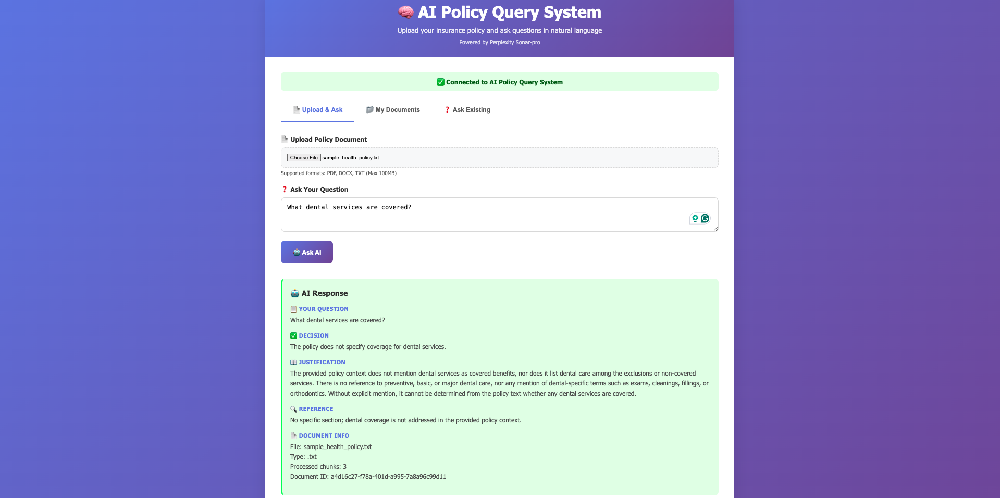

# 🤖 AI Policy Query System



An intelligent system for analyzing insurance policy documents and answering natural language questions using AI.

## ⚡ **Quick Start (TL;DR)**

```bash
# 1. Setup
git clone https://github.com/raazatul7/policy-ai-bot.git
cd policy-ai-bot
python3 -m venv venv
source venv/bin/activate
pip install -r requirements.txt

# 2. Configure API Key
echo "API_KEY=your_perplexity_api_key_here" > .env

# 3. Start All Services
./start_simple.sh start

# 4. Access
# 🌐 Frontend: http://localhost:3000
# 📚 API Docs: http://localhost:8000/docs
```

**📋 Prerequisites:** Python 3.8+, Perplexity API key
**🔑 Get API Key:** [Perplexity AI](https://www.perplexity.ai/)
**📄 License:** [MIT License](LICENSE)

## 📁 **Optimized Project Structure**

This project has been cleaned up to remove unnecessary empty folders and focus on essential functionality.

```
policy-ai-bot/
├── 📁 backend/                    # FastAPI backend
│   ├── 📁 core/                  # Core business logic
│   │   ├── document_parser.py    # Document parsing
│   │   ├── embedder.py          # Embedding generation
│   │   ├── retriever.py         # Document retrieval
│   │   └── llm_reasoner.py      # AI reasoning
│   └── main.py                  # FastAPI application
├── 📁 frontend/                 # Web frontend
│   └── index.html              # Main HTML file (all CSS/JS embedded)
├── 📁 config/                 # Configuration
│   └── settings.py            # App settings
├── 📁 data/                   # Data storage
├── 📁 logs/                   # Application logs
├── requirements.txt            # Python dependencies
└── README.md                  # This file
```

**🎯 Clean Architecture Benefits:**
- **No Empty Folders**: Removed unused placeholder directories
- **Focused Structure**: Only essential components remain
- **Easy Navigation**: Clear, simple folder hierarchy
- **Single-Page Frontend**: All UI code in one file for simplicity

## 🧪 **Testing the System**

### **Comprehensive Test Suite**

The system includes a comprehensive test suite that covers all major functionality:

#### **Test Categories:**
- **Environment Setup** - Python version, dependencies, API keys
- **Perplexity API** - AI model integration and response parsing
- **Document Parser** - PDF, DOCX, TXT file processing
- **Embedding System** - Text embedding generation and storage
- **Retriever System** - Semantic search and context retrieval
- **System Integration** - End-to-end document processing and querying
- **Edge Cases** - Error handling and boundary conditions
- **API Endpoints** - Server endpoints and health checks

#### **Running Tests:**
```bash
# Run all tests (recommended)
./run_tests.sh

# Or run Python test directly
python3 run_tests.py

# Run specific test categories
./run_tests.sh api          # Test Perplexity API only
./run_tests.sh parser       # Test document parser only
./run_tests.sh embedding    # Test embedding system only
./run_tests.sh integration  # Test system integration only
./run_tests.sh quick        # Quick health check

# With virtual environment
source venv/bin/activate && python3 run_tests.py
```

#### **Test Output Example:**
```
🧪 AI Policy Query System - Comprehensive Test Suite
============================================================

✅ Environment Setup: PASSED
✅ Perplexity API: PASSED
✅ Document Parser: PASSED
✅ Embedding System: PASSED
✅ Retriever System: PASSED
✅ System Integration: PASSED
✅ Edge Cases: PASSED
✅ API Endpoints: PASSED

📊 Results: 8/8 tests passed
🎉 All tests passed! System is ready to use.
```

#### **Troubleshooting Tests:**
- **API Key Issues**: Ensure `PERPLEXITY_API_KEY` is set in `.env`
- **Missing Dependencies**: Run `pip install -r requirements.txt`
- **Virtual Environment**: Activate with `source venv/bin/activate`
- **Server Tests**: Start server first with `./start_simple.sh start`

### **📊 Monitoring and Logs**

#### **Live Log Viewing:**
```bash
# View backend logs
./view_logs.sh backend

# View frontend logs
./view_logs.sh frontend

# View both logs simultaneously
./view_logs.sh both

# View only error messages
./view_logs.sh errors

# Show log file information
./view_logs.sh info
```

#### **Direct Log Commands:**
```bash
# View backend logs in real-time
tail -f logs/backend.log

# View frontend logs in real-time
tail -f logs/frontend.log

# View both logs with prefixes
tail -f logs/backend.log | sed 's/^/[BACKEND] /' & tail -f logs/frontend.log | sed 's/^/[FRONTEND] /' & wait
```

## 🚀 **How to Start the Project**

### **📋 Prerequisites**
- Python 3.8 or higher
- Perplexity API key (required)
- Git (for cloning)

### **1. 🛠️ Initial Setup**

#### **Clone and Navigate**
```bash
# Clone the repository
git clone <repository-url>
cd policy-ai-bot
```

#### **Create Virtual Environment**
```bash
# Create virtual environment
python3 -m venv venv

# Activate virtual environment
# On macOS/Linux:
source venv/bin/activate

# On Windows:
# venv\Scripts\activate
```

#### **Install Dependencies**
```bash
# Install all required packages
pip install -r requirements.txt
```

### **2. 🔑 Configure API Keys**

#### **Create Environment File**
Create a `.env` file in the project root:
```bash
# Create .env file
touch .env
```

#### **Add Your API Keys**
Edit the `.env` file with your API keys:
```bash
# Required: Perplexity API Key (Primary)
PERPLEXITY_API_KEY=your_perplexity_api_key_here

# Fallback: Generic API Key (if PERPLEXITY_API_KEY not set)
API_KEY=your_perplexity_api_key_here

# Optional: OpenAI API Key (for additional features)
OPENAI_API_KEY=your_openai_api_key_here

# Optional: System Configuration
MAX_FILE_SIZE_MB=100
DEBUG=True
HOST=0.0.0.0
PORT=8000
```

**💡 Get Your Perplexity API Key:**
1. Visit [Perplexity AI Settings](https://www.perplexity.ai/settings/api)
2. Sign up for an account if you haven't already
3. Navigate to API settings
4. Generate a new API key
5. Copy your API key (starts with `pplx-`)
6. Replace `your_perplexity_api_key_here` with your actual key

### **3. 🚀 Start the Server**

#### **Option 1: Complete System Startup (Recommended)**
```bash
# Start both frontend and backend servers
./start_simple.sh start

# Or with separate terminals (macOS)
./start_all.sh start
```

#### **Option 2: Backend Only**
```bash
# Make script executable (first time only)
chmod +x scripts/start_server.sh

# Start the backend server
./scripts/start_server.sh
```

#### **Option 3: Direct Python Execution**
```bash
# Start the server directly
python3 app.py
```

#### **Option 4: Manual Server Start**
```bash
# Activate virtual environment (if not already active)
source venv/bin/activate

# Start with uvicorn
uvicorn backend.main:app --host 0.0.0.0 --port 8000 --reload
```

### **4. 🌐 Access the System**

Once the server is running, you'll see:
```
🚀 Starting AI Policy Query System...
📍 Server will be available at: http://0.0.0.0:8000
📋 API Documentation: http://0.0.0.0/docs
🔍 Interactive API: http://0.0.0.0/redoc
```

#### **Available URLs:**
- **🌐 Main Server**: http://localhost:8000
- **📚 Interactive API Docs**: http://localhost:8000/docs
- **🔍 Alternative API Docs**: http://localhost:8000/redoc
- **💚 Health Check**: http://localhost:8000/health

### **5. 🧪 Test the System**

#### **Comprehensive Testing**
```bash
# Run all tests (recommended)
python3 run_tests.py

# Or activate virtual environment first
source venv/bin/activate && python3 run_tests.py
```

#### **Quick Health Check**
```bash
# Test if server is running
curl http://localhost:8000/health
```

#### **Run All Tests**
```bash
# Run comprehensive test suite
python3 run_tests.py
```

### **6. 📱 Start the Frontend (Optional)**

#### **Serve Frontend**
```bash
# Start the frontend server
./scripts/start_frontend.sh

# Or manually
python3 scripts/serve_frontend.py
```

#### **Access Frontend**
- **Frontend**: http://localhost:3000
- **Backend API**: http://localhost:8000

### **7. 🔧 Troubleshooting**

#### **Common Issues:**

**Port Already in Use:**
```bash
# Kill processes on port 8000
lsof -ti:8000 | xargs kill -9

# Or use a different port
export PORT=8001
python3 app.py
```

**Import Errors:**
```bash
# Ensure virtual environment is activated
source venv/bin/activate

# Reinstall dependencies
pip install -r requirements.txt
```

**API Key Issues:**
```bash
# Check if API key is loaded
python3 -c "import os; from dotenv import load_dotenv; load_dotenv(); print('API_KEY:', 'Found' if os.getenv('API_KEY') else 'Not found')"
```

**Memory Issues:**
```bash
# Check system resources
python3 -c "import psutil; print(f'Memory: {psutil.virtual_memory().percent}% used')"
```

### **8. 🛠️ Development Mode**

#### **Enable Debug Mode**
```bash
# Set debug environment variable
export DEBUG=True

# Start with auto-reload
python3 app.py
```

#### **Monitor Logs**
```bash
# View application logs
tail -f logs/app.log
```

### **9. 🚀 Production Deployment**

#### **Using Gunicorn**
```bash
# Install gunicorn
pip install gunicorn

# Start production server
gunicorn -w 4 -k uvicorn.workers.UvicornWorker app:app --bind 0.0.0.0:8000
```

#### **Using Docker**
```bash
# Build Docker image
docker build -t policy-ai-bot .

# Run container
docker run -p 8000:8000 policy-ai-bot
```

### **10. 📊 System Status**

#### **Check System Health**
```bash
# Health endpoint
curl http://localhost:8000/health

# System statistics
curl http://localhost:8000/stats
```

#### **Monitor Resources**
```bash
# Check memory usage
python3 -c "import psutil; m = psutil.virtual_memory(); print(f'Memory: {m.available/1024/1024:.1f}MB available')"

# Check disk space
python3 -c "import shutil; d = shutil.disk_usage('.'); print(f'Disk: {d.free/1024/1024/1024:.1f}GB free')"
```

---

### **🛑 Stop the Server**

```bash
# Stop all services (if using startup scripts)
./start_simple.sh stop

# If running in foreground: Ctrl+C

# If running in background:
ps aux | grep "python3 app.py" | grep -v grep | awk '{print $2}' | xargs kill

# Or kill by port:
lsof -ti:8000 | xargs kill -9
```

### **🔄 Restart the Server**

```bash
# Restart all services (if using startup scripts)
./start_simple.sh restart

# Stop and restart backend only
pkill -f "python3 app.py" && sleep 2 && ./scripts/start_server.sh

# Or with different port
export PORT=8001 && python3 app.py
```

### **📊 Check System Status**

```bash
# Check status of all services
./start_simple.sh status

# Check backend health
curl http://localhost:8000/health

# Check system stats
curl http://localhost:8000/stats
```

### **📝 Common Commands**

```bash
# Check server status
curl http://localhost:8000/health

# View logs
tail -f logs/app.log

# Run tests
python3 run_tests.py

# Check API key
python3 -c "import os; from dotenv import load_dotenv; load_dotenv(); print('API_KEY:', '✅ Found' if os.getenv('API_KEY') else '❌ Not found')"

# Monitor resources
python3 -c "import psutil; m = psutil.virtual_memory(); print(f'Memory: {m.available/1024/1024:.1f}MB available')"
```

---

## ✅ **Startup Checklist**

### **🚀 Before You Start**
- [ ] **Python 3.8+ installed** (`python3 --version`)
- [ ] **Git installed** (`git --version`)
- [ ] **Perplexity API key** obtained from [Perplexity AI](https://www.perplexity.ai/)

### **📋 Step-by-Step Verification**
```bash
# 1. Clone Repository
git clone <repository-url>
cd policy-ai-bot

# 2. Create Virtual Environment
python3 -m venv venv
source venv/bin/activate  # macOS/Linux
# venv\Scripts\activate   # Windows

# 3. Install Dependencies
pip install -r requirements.txt

# 4. Configure API Key
echo "API_KEY=your_perplexity_api_key_here" > .env
# Edit with your actual API key: nano .env

# 5. Test Configuration
python3 -c "import os; from dotenv import load_dotenv; load_dotenv(); print('API_KEY:', '✅ Found' if os.getenv('API_KEY') else '❌ Not found')"

# 6. Start All Services
chmod +x *.sh
./start_simple.sh start

# 7. Verify Services
curl http://localhost:8000/health
curl http://localhost:3000

# 8. Access System
# 🌐 Frontend: http://localhost:3000
# 📚 API Docs: http://localhost:8000/docs
# 💚 Health: http://localhost:8000/health
```

### **✅ Success Indicators**
- [ ] Server starts without errors
- [ ] Health endpoint returns `{"status":"healthy"}`
- [ ] API documentation loads at `/docs`
- [ ] All tests pass: `python3 run_tests.py`
- [ ] Can upload and query documents

### **🎯 Next Steps**
1. **Upload a document** via `/upload` endpoint
2. **Ask questions** via `/ask` or `/ask-existing` endpoints
3. **Explore API docs** at http://localhost:8000/docs
4. **Start frontend** with `./scripts/start_frontend.sh`

### **🔧 Quick Troubleshooting**

**❌ Port 8000 in use:**
```bash
lsof -ti:8000 | xargs kill -9
```

**❌ Import errors:**
```bash
source venv/bin/activate
pip install -r requirements.txt
```

**❌ API key not found:**
```bash
# Check .env file exists
ls -la .env

# Check API key is loaded
python3 -c "import os; from dotenv import load_dotenv; load_dotenv(); print('API_KEY:', 'Found' if os.getenv('API_KEY') else 'Not found')"
```

**❌ Memory issues:**
```bash
# Check available memory
python3 -c "import psutil; m = psutil.virtual_memory(); print(f'Available: {m.available/1024/1024:.1f}MB')"
```

---

**🎉 Your AI Policy Query System is now ready to analyze documents!**

## 🧪 **Testing**

### **Run All Tests**
```bash
# Using the test runner
python3 run_tests.py

# Or run directly
./run_tests.py
```

### **Run Specific Test Categories**
```bash
# Run all tests
python3 run_tests.py

# Or run the test script directly
./run_tests.py
```

## 📚 **Documentation**

- **API Documentation**: Available at http://localhost:8000/docs when server is running
- **Frontend Guide**: See `frontend/README.md` for frontend details
- **Configuration**: See `config/settings.py` for all settings

## 🔧 **Configuration**

All settings are centralized in `config/settings.py`:

- **API Keys**: Perplexity and OpenAI configuration
- **Model Settings**: Embedding and LLM model selection
- **System Limits**: File size, memory, and disk space limits
- **Server Settings**: Host, port, and CORS configuration

## 📊 **API Endpoints**

### **Core Endpoints**
- `POST /upload` - Upload policy documents
- `POST /ask` - Upload document and ask question
- `POST /ask-existing` - Ask question about processed documents
- `GET /documents` - List all processed documents
- `DELETE /documents/{id}` - Delete a document

### **Utility Endpoints**
- `GET /health` - Health check
- `GET /stats` - System statistics
- `GET /` - Root endpoint

## 🛠️ **Development**

### **Project Structure Benefits**
- **Modular Design**: Core components are separated and reusable
- **Simple Structure**: Clean, focused organization without unnecessary folders
- **Configuration Management**: Centralized settings for easy maintenance
- **Single-Page Frontend**: All UI code in one HTML file for simplicity
- **Core-Focused**: All business logic in `backend/core/` for easy understanding

### **Adding New Features**
1. **Core Logic**: Add to `backend/core/`
2. **API Routes**: Add to `backend/main.py` or create new modules
3. **Tests**: Add to `run_tests.py` or create test files
4. **Documentation**: Update this README or create new docs

## 🔒 **Security**

- **Input Validation**: All user inputs are sanitized
- **File Upload Security**: File type and size restrictions
- **API Key Protection**: Keys are stored in environment variables
- **CORS Configuration**: Proper cross-origin request handling
- **Error Handling**: Secure error messages without sensitive data

## 📈 **Performance**

- **Memory Management**: Automatic garbage collection
- **Disk Space Monitoring**: Prevents system overload
- **Efficient Embeddings**: Local and cloud embedding options
- **Caching**: Document processing results are cached
- **Async Processing**: Non-blocking API responses

## 🚀 **Deployment**

### **Production Setup**
```bash
# Install production dependencies
pip install -r requirements.txt

# Set production environment variables
export DEBUG=False
export HOST=0.0.0.0
export PORT=8000

# Start with production server
gunicorn -w 4 -k uvicorn.workers.UvicornWorker app:app
```

### **Docker Deployment**
```bash
# Build and run with Docker
docker build -t policy-ai-bot .
docker run -p 8000:8000 policy-ai-bot
```

## 🤝 **Contributing**

1. **Fork** the repository
2. **Create** a feature branch
3. **Add** tests for new functionality
4. **Update** documentation
5. **Submit** a pull request

## 📄 **License**

This project is licensed under the MIT License - see the LICENSE file for details.

---

**🎉 Ready to analyze your policy documents with AI!** 
